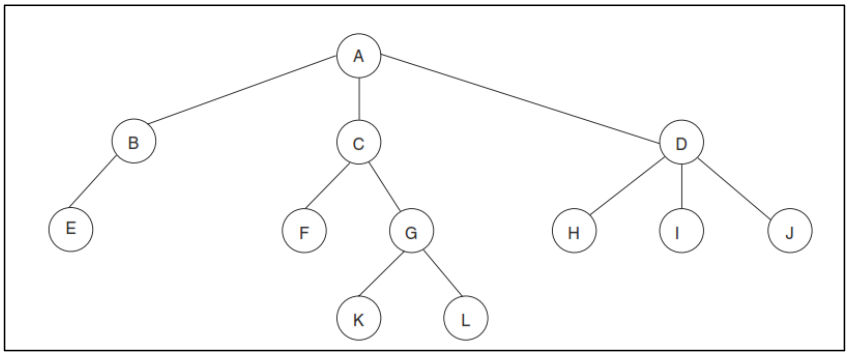
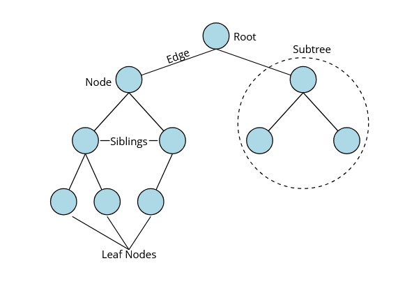
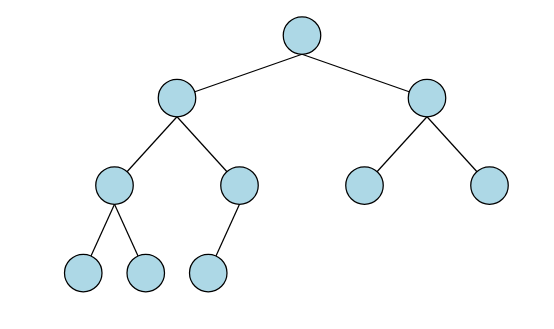
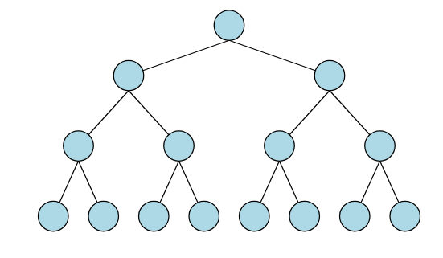
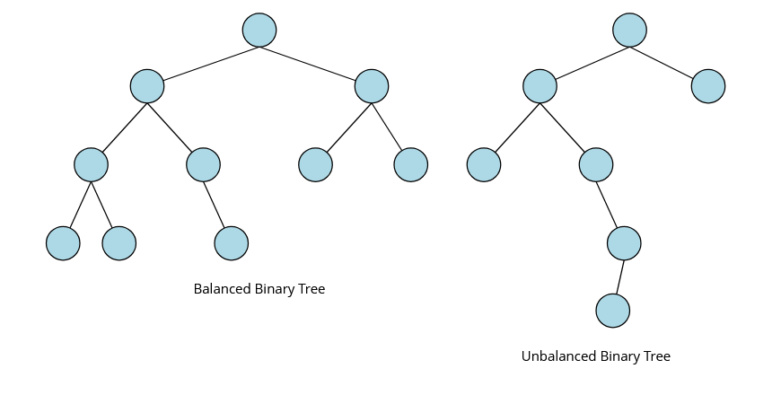
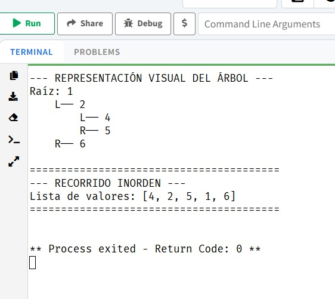

## Definicion.

Un **árbol** es definido como una serie de nodos donde se guardará información y también almacena la ubicación de los elementos sucesores. Lo que brinda homogeneidad en los datos que se almacenan en ellos, pudiendo tener más de un elemento posterior, pero solo tendrán un elemento que le anteceda.
Estas estructuras se usan para representar datos que tengan una relación de jerarquía entre sus elementos implicando recursividad, como si fuera un árbol genealógico de una persona. Pero si este carece de nodos se lo define como un árbol nulo que no posee raíz.[@unemi2020]

El **árbol binario** por otro lado Se lo define como un conjunto finito cero o más nodos, y puede ser implementado con facilidad en cualquier computadora. Considerando que cada nodo podrá tener de 0, 1 o 2 subárboles a la izquierda o a la derecha.[@interviewcake]

Este tipo de arboles son sorprendentemente potentes y eficientes. Con Implementaciones equilibradas, la mayoría de las operaciones son tiempo logarítmico La complejidad, lo que significa que las operaciones en árboles binarios son rápidas incluso cuando el número de nodos es grande.[@unemi2020]

## Definicion

Un árbol es definido como una serie de nodos donde se guardará información y también almacena la ubicación de los elementos sucesores. Lo que brinda homogeneidad en los datos que se almacenan en ellos, pudiendo tener más de un elemento posterior, pero solo tendrán un elemento que le anteceda.
Estas estructuras se usan para representar datos que tengan una relación de jerarquía entre sus elementos implicando recursividad, como si fuera un árbol genealógico de una persona. Pero si este carece de nodos se lo define como un árbol nulo que no posee raíz [@unemi2020].

El **árbol binario** por otro lado Se lo define como un conjunto finito cero o más nodos, y puede ser implementado con facilidad en cualquier computadora. Considerando que cada nodo podrá tener de 0, 1 o 2 subárboles a la izquierda o a la derecha [@interviewcake].

Este tipo de arboles son sorprendentemente potentes y eficientes. Con Implementaciones equilibradas, la mayoría de las operaciones son tiempo logarítmico La complejidad, lo que significa que las operaciones en árboles binarios son rápidas incluso cuando el número de nodos es grande [@unemi2020].

```Java
public class BinaryTreeNode {

    public int value;
    public BinaryTreeNode left;
    public BinaryTreeNode right;

    public BinaryTreeNode(int value) {
        this.value = value;
    }
}
```
**Representación general de un árbol.**

{fig-align="center" width=70%}

Las partes que conforman un árbol son:

*   **Nodo hijo**: Este siempre tendrá un nodo antecesor o superior del cual tomará su nombre.
*   **Nodo padre**: Es el nodo del cual se desprenden varios nodos hijos y se lo debe considerar como antecesor.
*   **Nodo hermano**: Son los que toman el nombre del nodo hermano si se desprenden del mismo nodo padre.
*   **Raíz**: El nodo superior del árbol, que no tiene nodo padre.
*   **Hoja o terminal**: Un nodo sin hijos; estos aparecen en la parte inferior del árbol.
*   **Interior**: Toman este nombre aquellos nodos que no son raíz ni hoja.
*   **Arista**: La conexión entre dos nodos.

{fig-align="center" width=70%}

### Tipos de árboles binarios.

*   **Árbol binario completo**: Este tipo de árboles se les dice completos si los nodos tienen exactamente dos subárboles, sin considerar los nodos que se encuentren en los niveles inferiores o más bajos. Si está lleno por completo, este árbol toma ese nombre “árbol lleno”. Mientras que aquel árbol que solo tenga un subárbol tomará el nombre de árbol “degenerado”.

{fig-align="center" width=70%}

*   **Árbol binario perfecto**: En este tipo de árbol binario no se pueden añadir más nodos sin crear un nuevo nivel. Los árboles binarios perfectos de altura h tienen $2^{h+1}-1$ nodos. Por su forma a menudo se parecen a los cuadros de torneos.

{fig-align="center" width=70%}

*   **Árbol binario equilibrado**: En estos, los subárboles de cada nodo tienen alturas similares, que normalmente difieren como máximo en uno. Garantiza que operaciones como la inserción, la eliminación y la búsqueda sean.

{fig-align="center" width=70%}

### Implementando Árboles Binarios en R.

A diferencia de los grafos, donde `igraph` es el estándar consolidado, R carece de un paquete único y universalmente adoptado para la creación de árboles binarios genéricos como tipos de datos abstractos. Aun asi, en cuanto al sistema de objetos, R ofrece varias alternativas para modelar nuestro propio nodo: S3 es el sistema orientado a objetos más antiguo y simple de R, el único usado en los paquetes base y `stats`, y el más común en los paquetes de CRAN. Es informal y flexible otorgando a los programadores una gran libertad, a costa de imponer pocas restricciones automáticas. Por contraste, S4 es más formal y tiende a requerir más planificación previa; su formalidad y estructura lo hacen más adecuado para equipos grandes, donde la mayor disciplina del sistema reduce la necesidad de convenciones informales.[@adv-r]

Aquí construiremos una representación sencilla de un nodo de árbol binario utilizando una clase S3, y mostraremos cómo se conectarían instancias de ese nodo para formar un árbol completo, con sus relaciones padre-hijo codificadas a través de referencias a otros nodos almacenados en los campos `left` y `right`. Cuando un campo apunta a `NULL`, indica la ausencia de ese hijo, marcando así un nodo hoja o un extremo del árbol:

```r
# Constructor de nodos para el árbol binario
# Un nodo contiene su valor y los enlaces a sus hijos
create_node <- function(value, left = NULL, right = NULL) {
node <- list(
value = value, # dato del nodo
left = left, # hijo izquierdo
right = right # hijo derecho
)

class(node) <- "tree_node" # asignamos una clase al nodo
return(node)
}


# Método print para nodos de la clase "tree_node"
# Muestra el valor del nodo y el de sus hijos
print.tree_node <- function(x, ...) {
cat("⮞ Nodo:", x$value, "\n")
cat(" ↳ Izquierdo:", if (!is.null(x$left)) x$left$value else "NULL", "\n")
cat(" ↳ Derecho: ", if (!is.null(x$right)) x$right$value else "NULL", "\n")
}


# Nivel 3 (hojas)
n4 <- create_node(4)
n6 <- create_node(6)
n9 <- create_node(9)
n12 <- create_node(12)

# Nivel 2
n5 <- create_node(5, left = n4, right = n6)
n10 <- create_node(10, left = n9, right = n12)

# Nivel 1 (raíz)
root <- create_node(8, left = n5, right = n10)

# Impresiones
print(root) # imprime el nodo raíz
print(root$left) # imprime el nodo hijo izquierdo (5)
print(root$right) # imprime el nodo hijo derecho (10)
print(root$left$right) # imprime el hijo derecho de 5 (6)
```
### Implementando Árboles Binarios en Pyton.
Hemos recorrido un camino fascinante por el mundo de las estructuras no lineales en R. Los **grafos**, con el soporte excepcional del paquete `igraph`, nos permiten modelar y analizar sistemas complejos donde las relaciones son primordiales, desde redes sociales hasta interacciones biológicas. Los **árboles binarios**, aunque su implementación en R a nivel de estructura de datos pura puede requerir un enfoque más "manual" o específico, son fundamentales para entender cómo se organizan y procesan los datos de forma jerárquica, subyaciendo a muchos algoritmos de búsqueda y toma de decisiones [@merino2017bosques].

#### Evidencia de la Implementación (Código y Salida)

```python
from dataclasses import dataclass
from typing import Optional, Any

# ==========================================
# 1. DEFINICIÓN DE LA ESTRUCTURA

@dataclass
class BinaryNode:
    value: Any
    left:  Optional['BinaryNode'] = None
    right: Optional['BinaryNode'] = None

def inorder(node: Optional[BinaryNode]):
    """Generador que recorre el árbol: Izquierda -> Raíz -> Derecha."""
    if node:
        yield from inorder(node.left)
        yield node.value
        yield from inorder(node.right)

def mostrar_arbol(node: Optional[BinaryNode], nivel: int = 0, prefijo: str = "Raíz: "):
    """Dibuja el árbol de forma visual en la consola."""
    if node is not None:
        indentacion = "    " * nivel
        print(f"{indentacion}{prefijo}{node.value}")
        if node.left or node.right:
            mostrar_arbol(node.left, nivel + 1, "L── ")
            mostrar_arbol(node.right, nivel + 1, "R── ")

# ==========================================
# 2. CONSTRUCCIÓN DEL ÁRBOL

# Hojas del árbol
hoja1 = BinaryNode(4)
hoja2 = BinaryNode(5)
hoja3 = BinaryNode(6)

# Nodo intermedio (Conecta 4 y 5 bajo el 2)
nodo_izquierdo = BinaryNode(2, left=hoja1, right=hoja2)

# Nodo raíz (Une todo el árbol)
raiz = BinaryNode(1, left=nodo_izquierdo, right=hoja3)

# ==========================================
# 3. RESULTADOS EN CONSOLA

print("--- REPRESENTACIÓN VISUAL DEL ÁRBOL ---")
mostrar_arbol(raiz)

print("\n" + "="*40)
print("--- RECORRIDO INORDEN ---")
print(f"Lista de valores: {list(inorder(raiz))}")
print("="*40) le hice unos cambieos para lo estetico
```
**Resultado**

{fig-align="center" width=70%}

### Implementación de árboles binarios en Java.
En el paradigma de Programación Orientada a Objetos , un árbol binario se modela mediante una clase que actúa como contenedor de nodos. Cada nodo es un objeto que encapsula el valor almacenado, usualmente mediante el uso de Genéricos en Java, T, para garantizar la reutilización de código, y dos referencias a otros objetos de la misma clase, representando sus subárboles.
La operación recursiva es el pilar para navegar esta estructura. Para un recorrido inorden, el algoritmo sigue la secuencia lógica: verificar si el nodo es nulo, invocar recursivamente la función para el hijo izquierdo, procesar el valor del nodo actual y, finalmente, invocar la función para el hijo derecho. Esta técnica asegura que, en un Árbol Binario de Búsqueda, los elementos sean visitados en orden ascendente [@arnold2005java].

```java
# ==========================================
# 1. DEFINICIÓN DE LA ESTRUCTURA

package estructuradatos;
public class BinaryNode<T> {
    public T value;
    public BinaryNode<T> left;
    public BinaryNode<T> right;

    public BinaryNode(T value) {
        this.value = value;
        this.left = null;
        this.right = null;
    }

    public BinaryNode(T value, BinaryNode<T> left, BinaryNode<T> right) {
        this.value = value;
        this.left = left;
        this.right = right;
    }
}
# ==========================================
# 2. Main

package estructuradatos;

public class Main {
    
    // El método inorder puede ir aquí dentro de la clase Main
    public static void inorder(BinaryNode<Integer> node) {
        if (node == null) return;
        inorder(node.left);
        System.out.print(node.value + " ");
        inorder(node.right);
    }

    public static void main(String[] args) {
        // Construcción del árbol
        BinaryNode<Integer> leaf1 = new BinaryNode<>(4);
        BinaryNode<Integer> leaf2 = new BinaryNode<>(5);
        BinaryNode<Integer> leaf3 = new BinaryNode<>(6);

        BinaryNode<Integer> nodeB = new BinaryNode<>(2, leaf1, leaf2);
        BinaryNode<Integer> root = new BinaryNode<>(1, nodeB, leaf3);

        // Llamada al recorrido
        System.out.print("Recorrido Inorden: ");
        inorder(root);
    }
}
```
### Implementación de árboles binarios en JavaScript.
A diferencia de otros lenguajes fuertemente tipados donde las estructuras de datos deben declararse mediante tipos rígidos, JavaScript ofrece un sistema de objetos dinámico que permite modelar árboles binarios de forma flexible. En particular, las clases introducidas en ES6 proveen una sintaxis más familiar para quienes provienen de lenguajes orientados a objetos tradicionales, aun cuando internamente siguen basándose en el sistema de prototipos propio del lenguaje. Esta flexibilidad facilita la construcción de estructuras como árboles binarios sin necesidad de definir jerarquías complejas o tipos estáticos.

En este contexto, podemos representar un nodo de un árbol binario como una clase simple cuyos campos almacenan tanto el valor contenido en el nodo como las referencias a sus hijos izquierdo y derecho. Cada nodo puede así apuntar explícitamente a otros nodos, creando la topología del árbol a través de enlaces directos entre objetos. Cuando uno de estos campos toma el valor null, se interpreta como la ausencia de un hijo, señalando que estamos frente a una hoja o al límite de una rama [@crockford2008javascript]:

```javascript
# ==========================================
# 1. Definición del nodo

// JavaScript moderno (ES6+) usa clases. Como el lenguaje es
// dinámico, no necesitamos declarar el tipo del valor.
class BinaryNode {
    constructor(value, left = null, right = null) {
        this.value = value;
        this.left  = left;
        this.right = right;
    }
}

// Alternativa funcional (factory function):
const makeNode = (value, left = null, right = null) =>
    ({ value, left, right });
// Produce un objeto plano: { value, left, right }

# ==========================================
# 2. Construcción del árbol

// Hojas
const leaf1 = new BinaryNode(4);
const leaf2 = new BinaryNode(5);
const leaf3 = new BinaryNode(6);

// Nodo intermedio
const nodeB = new BinaryNode(2, leaf1, leaf2);

// Raíz — también podemos construirlo de una vez:
const root = new BinaryNode(
    1,
    new BinaryNode(2,
        new BinaryNode(4),
        new BinaryNode(5)
    ),
    new BinaryNode(6)
);

# ==========================================
# 3. Recorrido inorden con función generadora

// function* define un generador — yield pausa y devuelve valores.
function* inorder(node) {
    if (node === null) return;
    yield* inorder(node.left);
    yield  node.value;
    yield* inorder(node.right);
}

console.log([...inorder(root)]);
// [4, 2, 5, 1, 6]

// Versión sin generador (recursión clásica):
function inorderSimple(node, result = []) {
    if (!node) return result;
    inorderSimple(node.left,  result);
    result.push(node.value);
    inorderSimple(node.right, result);
    return result;
}
```

**Enlace del repositorio**: https://github.com/kleyners22/estructuradedatosunlGrupo7
**Enlace del video**: https://drive.google.com/drive/folders/1n4_AucsRG3DHZbrP2y9KgEKUytJfz9WK?usp=sharing
